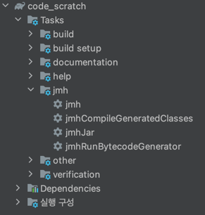

# JMH 사용
## gradle으로 JMH 사용하는 법
### build.gradle
gradle version  : gradle-8.9-bin
```commandline
plugins {
    id 'java'
    id "me.champeau.jmh" version "0.7.2"
}

jmh {
    fork = 2
    warmupIterations = 5
    iterations = 5
}

dependencies {
    testImplementation platform('org.junit:junit-bom:5.9.1')
    testImplementation 'org.junit.jupiter:junit-jupiter'
    jmh 'org.openjdk.jmh:jmh-core:0.9'
    jmh 'org.openjdk.jmh:jmh-generator-annprocess:0.9'
}
```

### jmh 설정
- fork
  - fork는 벤치마크가 실행될 때 새로운 JVM 프로세스를 몇 번 시작할지를 설정
  - 벤치마크 실행 전 JVM이 여러 번 시작되면, 초기화나 JIT 컴파일러에 의해 성능이 영향을 받을 수 있는 가능성을 줄일 수 있습니다.
  - 2 또는 3으로 설정하는 것이 일반적입니다. 이렇게 하면 여러 JVM에서 벤치마크가 실행되어 초기 JVM 상태가 결과에 영향을 미치는 것을 최소화할 수 있습니다.
  - 워밍업 반복 횟수를 10회로 설정하는 것이 보편적입니다. 이렇게 하면 JIT 컴파일러가 충분히 코드를 최적화할 시간을 갖게 되어, 이후의 벤치마크 실행에서 정확한 성능을 측정할 수 있습니다.
- warmupIterations
  - 실제 벤치마크를 수행하기 전에 워밍업을 몇 번 실행할지를 설정
  - 워밍업 단계에서는 JVM의 JIT 컴파일러가 코드를 최적화할 시간이 주어지기 때문에, 이 과정 없이 곧바로 측정을 시작하면 실제 성능을 반영하지 않을 수 있습니다.
  - 무조건 처음 실행한 화면의 결과 값은 무시해야한다. 클래스를 메모리로 로딩할때는 시간이 오래 걸리기 때문에, 그때 측정한 결과 값은 의미가 없다. 
- iterations
  - 벤치마크를 몇 번 반복해서 측정할지를 설정 
  - 반복 측정 횟수도 10회로 설정하는 것이 좋습니다. 이렇게 하면 평균적인 성능을 도출할 수 있으며, 결과가 특정 상황에 지나치게 치우치는 것을 방지할 수 있습니다.

### 폴더 구조
```commandline
project
    └─── src
          └─── jmh
                └─── java
                       └─── test
```
jmh 폴더 밖으로 나가면 jmh 관련 어노테이션을 사용할 수 없다.

## 코드
```commandline
package test;

import java.util.ArrayList;
import java.util.LinkedList;
import java.util.List;
import java.util.Vector;
import java.util.concurrent.TimeUnit;

import org.openjdk.jmh.annotations.Benchmark;
import org.openjdk.jmh.annotations.BenchmarkMode;
import org.openjdk.jmh.annotations.Level;
import org.openjdk.jmh.annotations.Mode;
import org.openjdk.jmh.annotations.OutputTimeUnit;
import org.openjdk.jmh.annotations.Scope;
import org.openjdk.jmh.annotations.Setup;
import org.openjdk.jmh.annotations.State;

@State(Scope.Thread)
@BenchmarkMode(Mode.AverageTime)
@OutputTimeUnit(TimeUnit.MICROSECONDS)
public class ReadList {
	int LOOP_COUNT = 1000;
	List<String> arrayList;
	String data = "abcdefghijklmnopqrxyz";
	String result;

	@Setup(Level.Trial)
	public void setUp() {
		arrayList = new ArrayList<>();
		for (int i = 0; i < LOOP_COUNT; i++) {
			String temp = data + i;
			arrayList.add(temp);
		}
	}

	@Benchmark
	public void arrayList() {
		for (int i = 0; i < LOOP_COUNT; i++) {
			result = arrayList.get(i);
		}
	}
}

```

### 실행

gradle 툴을 이용해 jmh 실행

## 에러
```
Exception in thread "main" java.lang.RuntimeException: ERROR: Unable to find the resource: /META-INF/BenchmarkList
```
Enable annotation processing에 체크가 되어있어야한다.

```commandline
java: Benchmark class should have package other than default.
```
src>java 폴더 바로 밑에 클래스를 두면 안되고 적당히 패키지를 더 만들어야 한다.


## 참고
https://hyesun03.github.io/2019/08/27/how-to-benchmark-java/
https://pompitzz.github.io/blog/Java/jmh_and_asyncProfiler.html#%E1%84%87%E1%85%A6%E1%86%AB%E1%84%8E%E1%85%B5%E1%84%86%E1%85%A1%E1%84%8F%E1%85%B3-%E1%84%8F%E1%85%B3%E1%86%AF%E1%84%85%E1%85%A2%E1%84%89%E1%85%B3-%E1%84%8C%E1%85%A1%E1%86%A8%E1%84%89%E1%85%A5%E1%86%BC