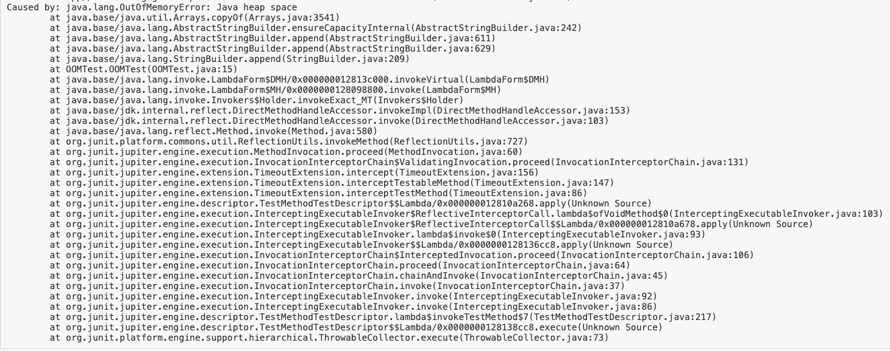

# static
- static 으로 선언한 인스턴스 변수는 클래스의 변수가 된다. 100개의 클래스 인스턴스를 생성하더라도 모든 객체가 동일한 클래스 변수의 주소 값을 참조한다.
- 자주 사용하고 절대 변하지 않는 변수는 final static 으로 지정하자.
  - final static 으로 선언하면 적어도 1바이트 이상의 객체가 GC 대상에 포함되지 않는다.
  - 템플릿 성격의 객체를 static 으로 선언하는 것도 성능 향상에 많은 도움이 된다. 클래스가 로딩될 때 한 번만 파싱하므로 성능이 엄청나게 향상된다.
    - 하지만 template 내용이 지속적으로 변경되는 부분이라면 적용해선 안된다.
- 설정 파일 정보도 static 으로 관리하자
  - 객체를 생성할 때마다 설정 파일을 로딩하면 엄청난 성능 저하가 발생한다. 반드시 static 으로 관리하자
## memory leak
```commandline
static ArrayList list = new ArrayList();
static StringBuilder dummyStr;

public void add(){
    dummyStr = "123";
    for(int i=0; i<20; i++) {
        dummyStr.append(dummyStr);
    }
    
    list.add(dummyStr.toString());
}

```

더 이상 사용 가능한 메모리가 없어지는 현상을 memory leak 이라고한다. static 과 collection 객체를 잘못 사용하면 발생한다.
static 으로 선언한 부분은 GC 가 발생하지 않는다. 어떤 클래스에 데이터를 List 에 담을때
해당 객체를 static 으로 선언한다면 지속적으로 해당 객체에 데이터가 쌓여 더 이상 GC 가 되지 않으면서 OOM 이 발생한다.

