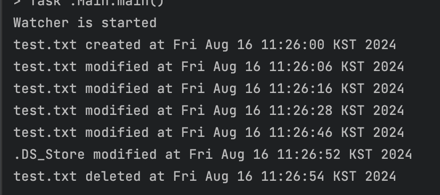

# 기본적인 IO 처리
- 바이트 기반의 스트림 : java.io.InputStream, OutputStream
- 문자열 기반의 스트림 : java.io.Reader, Writer
- 한 번 연 스트림은 반드시 닫아 주어야 한다.
- 사용자에게 요청 받을때마다 최신 버전인지 확인하는 코드가 있으면 이전 파일들의 최신 업데이트 정보를 읽어오는 IO 처리로 인해 성능이 느려질 수 있다. 
- 변경된 파일의 최신 버전을 알기 위해서는 데몬 스레드를 하나 생성하여 5분이나 10분에 한 번씩 최신 버전을 확인하도록 하는 스레드를 만드는 것을 추천한다.
- 하지만!!!! JDK 7 부터 추가된 watcher 를 통해서 해당 파일이 변경되었는지 쉽게 모니터링 할 수 있다.

## 파일의 변경을 이벤트처럼 처리하는 WatcherService
1. Path 객체를 생성하여 모니터링할 디렉터리를 지정한다.
2. WatcherService 클래스로 객체를 생성한다.
3. Path 객체의 register 메서드를 활용하여 파일의 생성, 수정, 삭제되는 이벤트를 처리하도록 지정한다.
4. watcher 객체의 take() 메서드를 호출하면 해당 디렉터리에 변경이 있을때까지 기다리다가 작업이 발견되면 WatcherKey 클래스의 객체가 생성된다.
5. 파일에 변화가 생겼다면 이벤트의 목록을 가져온다.
6. 이벤트를 처리한 다음에 key 객체를 reset 한다.

code : https://github.com/ohsuha/code_scratch/blob/master/code_scratch/src/main/java/test/watcherservicetest/WatcherThread.java <br>



## IO 순서
1. 파일을 읽으라는 메서드를 자바에 전달한다.
2. 파일명을 전달받은 메서드가 운영체제의 커널에게 파일을 읽어 달라고 요청한다.
3. 커널이 하드 디스크로부터 파일을 읽어서 자신의 커널에 있는 버퍼에 복사하는 작업을 수행한다. DMA 에서 이 작업을 수행한다.
   - DMA : Direct Memory Access의 약자. 이는 하드웨어 컴퓨터 아키텍처의 개념으로, CPU를 거치지 않고 직접 메모리와 디바이스 간에 데이터를 전송할 수 있는 기능
4. 자바에서는 마음대로 커널의 버퍼를 사용하지 못하므로, JVM으로 데이터를 전달한다.
5. JVM 메서드에 있는 스트림 관리 클래스를 사용하여 데이터를 처리한다.

자바에서는 3번 작업이나 4번 전달 작업을 수행할 때 대기시간이 발생할 수 밖에 없다.
- 하드 디스크로부터 파일을 읽어오는 과정 (3번 작업)
   디스크 I/O 지연: 하드 디스크(HDD) 또는 SSD에서 데이터를 읽는 과정은 물리적 장치의 특성에 따라 지연이 발생할 수 있습니다. 특히 HDD의 경우, 디스크의 회전 속도와 헤드 위치 변경(탐색 시간) 때문에 지연이 더 길어질 수 있습니다.
   - DMA 설정 및 준비 시간: DMA를 통해 데이터를 전송하기 위해, 메모리와 디바이스 간에 전송 경로를 설정하고 준비하는 시간이 필요합니다. 이 과정에서도 작은 대기시간이 발생할 수 있습니다.
   - 버퍼 전송 지연: 데이터를 커널의 버퍼로 복사하는 과정에서도 하드웨어적 지연이 발생할 수 있습니다. 디스크와 메모리 간의 전송 속도가 동일하지 않기 때문에 전송 속도의 불일치로 인해 대기시간이 발생할 수 있습니다. 
- 커널-유저 모드 전환 비용: 커널의 버퍼에 저장된 데이터를 JVM으로 전달하기 위해서는 커널 모드에서 유저 모드로 전환이 필요합니다. 이 과정에서 시스템 호출(syscall)이 발생하며, 이로 인해 CPU 컨텍스트 스위칭이 일어나면서 대기시간이 생깁니다.
   - 데이터 복사 비용: 커널의 버퍼에서 JVM으로 데이터를 복사할 때, 데이터가 메모리 내에서 이동하면서 시간 소모가 발생합니다. 특히, 큰 파일을 처리할 때는 데이터 복사 작업이 더 오래 걸릴 수 있습니다.
   - 동기화 및 경쟁 상태: Java는 여러 스레드에서 I/O 작업을 처리할 수 있으며, 이 과정에서 스레드 간의 동기화가 필요할 수 있습니다. 또한, 여러 프로세스가 동일한 파일이나 리소스를 접근하려고 할 때 발생하는 경쟁 상태로 인해 자원이 잠기고, 대기시간이 추가될 수 있습니다.

# NIO
NIO 에서는 IO 처리 방법의 3번을 자바에서 직접 통제하여 시간을 더 단축할 수 있게 했다
- 버퍼의 도입
- 채널의 도입
- 문자열의 엔코더와 디코더 제공
- Perl 스타일의 정규 표현식에 기초한 패턴 매칭 방법 제공
- 파일을 잠그거나 메모리 매핑이 가능한 파일 인터페이스 제공
- 서버를 위한 복합적인 논블록킹 IO제공

## NIO 유의점 - DirectByteBuffer 는 하나의 객체만 생성하자
- DirectByteBuffer의 생성자는 Bits 라는 클래스의 reserveMemory()를 호출한다.
- reserveMemory()는 JVM 에 할당되어 있는 메모리보다 더 많은 메모리를 요구할 경우 System.gc()메서드(가비지 콜렉터를 실행하는)를 호출한다.
- 따라서 생성자가 무차별적으로 생성될 경우 GC가 자주 발생하고 성능에 영향을 줄 수 밖에 없다.
- 꼭 사용해야 한다면 싱글톤 패턴을 사용하여 하나의 객체만 생성하는 것을 권장한다. 
```agsl
    // DirectByteBuffer의 Primary constructor
    DirectByteBuffer(int cap) {                   // package-private

        super(-1, 0, cap, cap, null);
        boolean pa = VM.isDirectMemoryPageAligned();
        int ps = Bits.pageSize();
        long size = Math.max(1L, (long)cap + (pa ? ps : 0));
        Bits.reserveMemory(size, cap);

        long base = 0;
        try {
            base = UNSAFE.allocateMemory(size);
        } catch (OutOfMemoryError x) {
            Bits.unreserveMemory(size, cap);
            throw x;
        }
        UNSAFE.setMemory(base, size, (byte) 0);
        if (pa && (base % ps != 0)) {
            // Round up to page boundary
            address = base + ps - (base & (ps - 1));
        } else {
            address = base;
        }
        try {
            cleaner = Cleaner.create(this, new Deallocator(base, size, cap));
        } catch (Throwable t) {
            // Prevent leak if the Deallocator or Cleaner fail for any reason
            UNSAFE.freeMemory(base);
            Bits.unreserveMemory(size, cap);
            throw t;
        }
        att = null;
    }
```

```agsl
    static void reserveMemory(long size, long cap) {

        if (!MEMORY_LIMIT_SET && VM.initLevel() >= 1) {
            MAX_MEMORY = VM.maxDirectMemory();
            MEMORY_LIMIT_SET = true;
        }

        // optimist!
        if (tryReserveMemory(size, cap)) {
            return;
        }

        final JavaLangRefAccess jlra = SharedSecrets.getJavaLangRefAccess();
        boolean interrupted = false;
        try {

            // Retry allocation until success or there are no more
            // references (including Cleaners that might free direct
            // buffer memory) to process and allocation still fails.
            boolean refprocActive;
            do {
                try {
                    refprocActive = jlra.waitForReferenceProcessing();
                } catch (InterruptedException e) {
                    // Defer interrupts and keep trying.
                    interrupted = true;
                    refprocActive = true;
                }
                if (tryReserveMemory(size, cap)) {
                    return;
                }
            } while (refprocActive);

            // trigger VM's Reference processing
            System.gc();
            ...이하 생략            
```