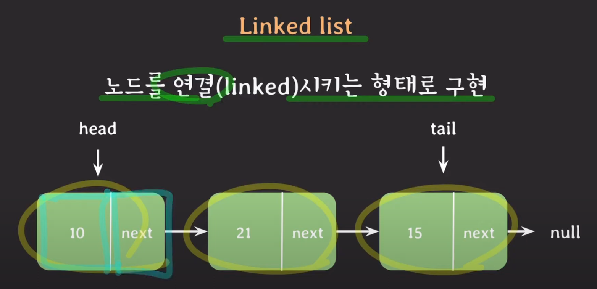
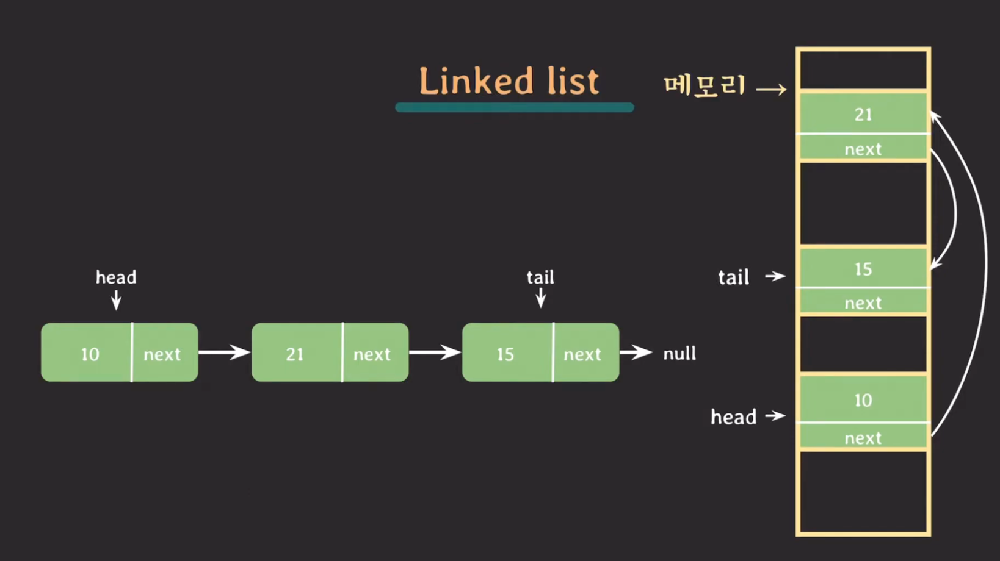

# LinkedList


```java
public class LinkedList<E>
    extends AbstractSequentialList<E>
    implements List<E>, Deque<E>, Cloneable, java.io.Serializable{}
```
- AbstractSequentialList 를 확장함
- 배열의 단점을 보완하기 위해서 고안된 자료 구조
    - 크기를 변경할 수 없다.
    - 비순차적인 데이터의 추가, 삭제에 시간이 많이 걸림
- 링크드 리스트의 각 요소들은 자신과 연결된 다음 요소에 대한 참조 주소값과 데이터로 구성되어있다.
- 데이터 추가, 삭제시 복사 과정없이 하나의 참조만 변경하면 되므로 처리 속도가 빠르다.
- 기존 링크드 리스트는 다음 데이터에 대한 참조만 있어 한방향으로만 가지만 이를 극복하기 위해 더블 링크드 리스트가 나왔다.
- 더블 링크드 리스트는 이전 참조변수를 참조한다.
- 링크드 리스트 -> 써큘러 링크드 리스트(tail 의 next 가 head를 가르킴) -> 더블 링크드 리스트 (앞과 뒤 연결) -> 더블 써큘러 링크드 리스트 (처음과 끝 연결 + 앞뒤 방향)

## 메소드
| 메소드 | 설명 |
|--------|------|
| `void addFirst(E e)` | 리스트의 시작 부분에 지정된 요소를 추가. |
| `void addLast(E e)` | 리스트의 끝 부분에 지정된 요소를 추가. |
| `E getFirst()` | 리스트의 첫 번째 요소를 반환. |
| `E getLast()` | 리스트의 마지막 요소를 반환. |
| `E removeFirst()` | 리스트의 첫 번째 요소를 제거하고 반환. |
| `E removeLast()` | 리스트의 마지막 요소를 제거하고 반환. |
| `boolean offerFirst(E e)` | 리스트의 시작 부분에 지정된 요소를 추가, 성공하면 true 반환. |
| `boolean offerLast(E e)` | 리스트의 끝 부분에 지정된 요소를 추가, 성공하면 true 반환. |
| `E pollFirst()` | 리스트의 첫 번째 요소를 제거하고 반환, 비어 있으면 null 반환. |
| `E pollLast()` | 리스트의 마지막 요소를 제거하고 반환, 비어 있으면 null 반환. |
| `E peekFirst()` | 리스트의 첫 번째 요소를 반환, 비어 있으면 null 반환. |
| `E peekLast()` | 리스트의 마지막 요소를 반환, 비어 있으면 null 반환. |
| `E element()` | 리스트의 첫 번째 요소를 반환, 비어 있으면 `NoSuchElementException` 발생. |
| `boolean offer(E e)` | 큐의 끝에 지정된 요소를 추가, 성공하면 true 반환. |
| `E peek()` | 큐의 첫 번째 요소를 반환, 비어 있으면 null 반환. |
| `E poll()` | 큐의 첫 번째 요소를 제거하고 반환, 비어 있으면 null 반환. |
| `boolean remove(Object o)` | 리스트에서 지정된 요소의 단일 발생을 제거, 성공하면 true 반환. |

## Array List 와의 비교
- 순차적으로 추가/삭제하는 경우는 어레이리스트가 더 빠르다.
  - 삭제시 어레이는 제일 마지막것만 null 로 변경하면 된다.
  - 추가시 초기 용량이 충분하다면 어레이가 더 빠르지만 용량을 넘어간다면 링크드가 더 빠를 수도 있다.
- 중간 데이터의 추가/삭제 하는 경우는 링크드 리스트가 더 빠르다. -> 검증 결과 아니다 어레이리스트가 더 빠름
- 인덱스가 n 인 요소의 값을 얻어올때,배열은 각 요소들이 연속적으로 각각의 주소를 가지고 메모리상에 존재하기 때문에 간단히 가져올수있다.
- 하지만 링크드리스트는 불연속적으로 위치한 요소들이 서로 연결된 것이라 차례대로 n 번째 데이터까지 접근해야한다. 데이터가 많을수록 요소를 얻어오는 시간이 증가한다.

## 메모리 저장 구조에 차이가 크다!

메모리 공간상에서 arrayList 는 배열을 이용해서 연속적으로 저장되지만, linked list 는 노드를 이용해서 연결되어있기 때문에 띄엄띄엄 저장되어있다.