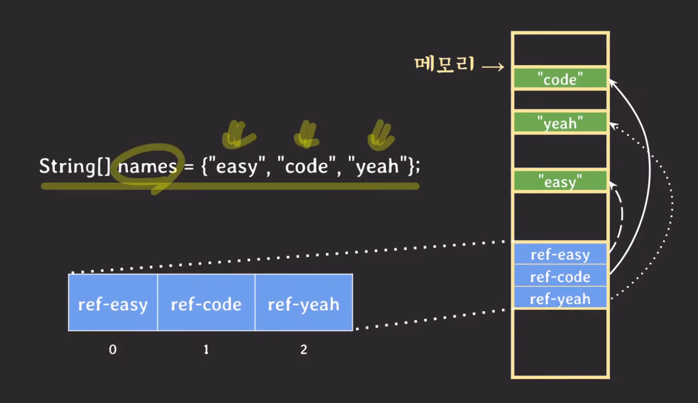

# Array


> 같은 타입의 데이터들을 저장하는 자료 구조

연속된 메모리 공간에 데이터를 저장하기 때문에 cpu cache를 통해 같은 배열에 있는 다른 데이터에 접근하는 시간을 단축할 수 있다.<br>
데이터 각각은 이름이 없지만 인덱스를 통해 접근 가능하다.

index는 배열에서 offset 개념으로 지정된다.
```java
int[] a = {1,2,3,4};
```
a로부터 각 1,2,3,4가 얼마나 떨어져있는가 이므로 a와 바로 붙어있는 `1`은 `0`의 인덱스를 갖게 된다.
배열이 가르키고 있는 첫번째 원소로부터 0번째 떨어져있기 때문에 0이 된다.
배열을 호출하는 것은 배열이름과 위치에 해당하는 index를 통해 접근이 가능하다.

배열은 연속된 메모리 공간을 사용한다. 메모리 공간상에서 연속적으로 데이터를 할당받고 위치를 점유하게 된다.
2차원 배열이더라도 메모리 구조는 1차원이기 때문에 1차원으로 저장된다.


- 객체를 배열에 담았을때는 해당 값은 메모리에 따로 저장되어있고, 각 객체의 메모리주소(레퍼런스)를 배열에 저장하게된다. 
- 즉 참조형 타입이 배열에 저장될 경우 배열에는 실제 객체를 가르키는 주소를 배열에 연속적으로 갖고 있게 된다.
- 객체자체는 연속적인 메모리 공간에 저장되지 않는다.

## Dynamic Array 동적 배열
동적 배열이라는 뜻으로 크기가 변할 수 있는 배열을 말한다.
데이터를 더하거나 빼는 것이 가능한 구조이다.

배열에 비어있는 공간이 없어서 더이상 데이터가 추가될 자리가 없으면 전체 크기의 2배를 갖는 배열을 새로 만들고,
새로 만들어진 배열로 기존 값을 복사하고 새로운 값을 추가한다. 예 : array List 

## Associative Array 연관 배열
연관 배열이라는 뜻으로 키 밸류 페어를 저장하는 ADT. 
같은 키를 가지는 페어는 최대 한개만 존재 가능하다. 예 : map, dictionary 