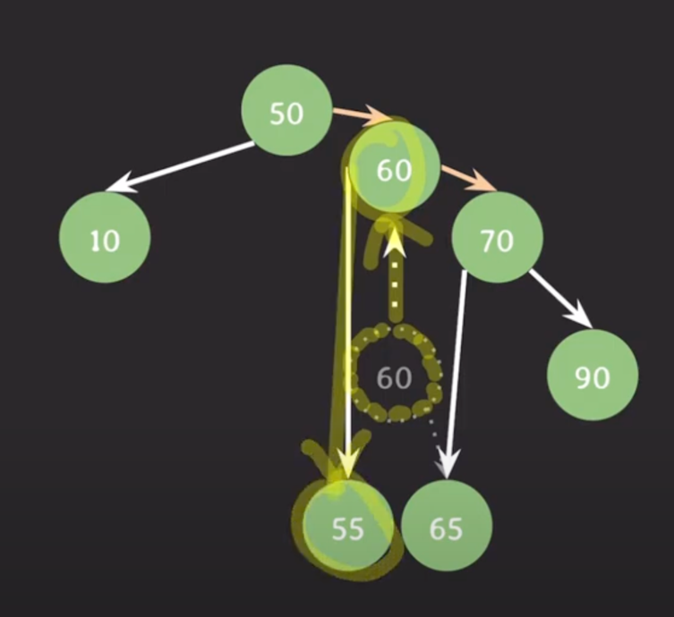

# Tree
- 노드들의 집합
- 각 노드는 값과 다른 노드들을 가리키는 레퍼런스들로 구성되어 있다.
  - 값뿐만아니라 다른 노드를 가르키는 레퍼런스까지 포함된다.

## 주요 용어
- 간선 edge : 노드와 노드를 연결하는 선, 구현 관점에서는 레퍼런스를 의미한다.
- 루트 노드 : 트리의 최상단에 있는 노드, 트리의 시작점.
- 자녀 노드 : 트리구조의 모든 노드는 0개 이상의 자녀 노드를 가진다.
- 부모 노드 : 자녀 노드를 가지는 노드
- 형제 노드 : 같은 부모를 가지는 노드들
- 조상 노드 : 부모노드를 따라 루트 노드까지 올라가며 만나는 모든 노드
- 자손 노드 : 자녀 노드를 따라 내려가며 만날 수 있는 모든 노드
- 내부 노드 : 자녀 노드를 가지는 모든 노드를 말한다
- 외부 노드 : 자녀 노드가 없는 노드 leaf, outer, terminal, 단말 노드 라고도 불린다.
- 경로 : 한 노드에서 다른 노드 사이의 노드들의 시퀀스. 루트 노드에서 특정 노드를 가기 위한 경로
- 경로 길이 : 경로에 있는 노드들의 수 
- 노드의 높이 : 노드에서 리프 노드까지의 가장 긴 간선의 수, 리프노드의 높이는 0
- 트리의 높이 : 루트 노드의 높이
- 노드의 깊이 : 루트 노드에서 해당 노드까지의 경로의 간선 수, 루트 노드의 깊이는 0
- 트리의 깊이 : 트리에 있는 노드들의 깊이중 가장 긴 깊이. 루트노드로부터 가장 멀리 떨어져있는 리프 노드까지의 간선의 수 트리의 높이=트리의 깊이
- 노드의 차수 : 노드의 자녀 노드수 
- 트리의 차수 : 트리에 있는 모든 노드들의 차수 중 가장 큰 차수. 자식이 가장 많은 노드의 자식 수
- 두 노드 사이의 거리 : 두 노드의 최단 경로의 간선 수
- 노드의 레벨 : 노드와 루트 노드 사이의 경로에서 간선의 수
- width : 임의의 레벨에서 노드의 수(가로수)
- 노드의 크기 : 자기 자신을 포함한 자손 노드의 수
- 트리의 크기 : 트리의 모든 노드의 수
- 서브 트리 : 모드 노드들은 각 노드의 자녀 노드들을 재귀적으로 서브 트리를 구성한다. 트리를 부분적으로 떼어내면 또다른 트리가 만들어진다.

## 트리 구조의 주요 특징
1. 루트 노드는 하나만 존재한다.
2. 사이클이 존재하지 않는다.
3. 자녀노드가 하나의 부모 노드만 가질 수 있다.
4. 데이터를 순차적으로 저장하지 않는 비선형 구조
5. 트리에 서브 트리가 있는 재귀적 구조
6. 계층적 구조

# 이진 트리
각 노드의 자녀 노드수가 최대 두개인 트리. left child, right child를 가진다.

### full binary tree(정 이진 트리)
- 모든 노드는 자녀 노드가 없거나 두개인 트리. 자녀 노드가 한개인 트리는 없다.
### complete binary tree(완전 이진 트리)
마지막 레벨을 제외한 모든 레벨에서 노드가 빠짐없이 채워져있고 마지막 레벨은 왼쪽부터 빠짐없이 노드가 채워져있는 트리
### perfect binary tree(포화 이진 트리)
모든 레벨에서 노드가 빠짐없이 채워져 있는 트리
### degenerate binary tree(변질 이진 트리)
모든 부모노드는 하나의 자녀 노드만 가지는 트리, 왼쪽 자녀 노드만 가지거나 오른쪽 자녀 노드를 가지는 트리가 있다.
### balanced binary tree(균형 이진 트리)
모든 노드에서 왼쪽 서브트리와 오른쪽 서브트리의 높이 차이가 최대 1인 트리

# 이진 탐색 트리 (BST)
모든 노드의 왼쪽 서브트리는 해당 노드의 값보다 작은 값들만 가지고, 모든 노드의 오른쪽 서브트리는 해당 노드의 값보다 큰 값들만 가진다.
- 최소값 : 트리의 가장 왼쪽 하단에 있다.
- 최대값 : 트리의 가장 오른쪽 하단에 있다.

## 순회
이진 탐색 트리의 모든 노드들을 한번씩 방문하는 것을 뜻한다.

### inorder traversal (중위 순회)

출발은 항상 루트 노드, 루트노드에서 왼쪽으로 쭉 가서 방문, 상위로 올라가서 방문, 다음으로는 오른쪽 서브 트리 순회.
결과적으로 보면 작은 수부터 차례대로 순회하게 된다.

### preorder traversal(전위 순회)
현재 노드를 무조건 방문하고, 재귀적으로 왼쪽 서브 트리 순회, 재귀적으로 오른쪽 서브트리 순회

### postorder traversal(후위 순회)
루트 노드에서 왼쪽 서브트리 순회, 재귀적으로 오른쪽 서브 트리 순회, 현재 노드 방문

### 노드의 succesor(후임자)
해당 노드보다 값이 큰 노드들 중에서 가장 값이 작은 노드

### 노드의 predecessor(선임자)
해당 노드보다 값이 작은 노드들 중에서 가장 값이 큰 노드

## 이진 탐색 트리 삽입/삭제/검색
- 입력되는 값과 노드를 비교하여 작으면 왼쪽 크면 오른쪽에 넣는다.
- 삭제하려는 노드가 있는지 검색 후 있으면 삭제
  - 자녀가 없는 리프노드의 경우 그냥 null 로 날리면 된다.
  - 자녀가 하나인 노드를 삭제하는 경우 삭제될 노드를 가리키던 레퍼런스를 삭제될 노드의 자녀를 가리키게 변경 한다.
  - 자녀가 두개인 노드를 삭제하는 경우 삭제할 노드를 기준으로 오른쪽 서브트리에서 값이 가장 작은 노드가 삭제될 노드를 대체한다.

## 이진 탐색 트리의 시간 복잡도
### best : root

90을 insert, delete, search 하는 베스트 케이스의 경우

### avg 

임의의 각 노드에서 오른쪽, 왼쪽의 밸런스가 맞춰져있는 경우

### worst : leaf

트리가 한쪽으로 편항된 상태에서 1을 저장해야할때. 모든 노드를 한번씩 확인을 해줘야한다.

## 이진 탐색 트리의 장점
1. 삽입 삭제가 유연하다.
   - 노드 하나 만들어서 연결만 해주면 된다.
   - 레퍼런스만 재조정해주면 된다.
2. 값의 크기에 따라 좌우 서브트리가 나눠지기 떄문에 삽입/삭제/검색이 빠르다.
3. 값의 순서대로 순회가 가능하다. 정렬된 형태로 접근이 가능하다.

## 이진 탐색 트리의 단점
1. 모든 트리의 노드들을 방문해야하는 케이스가 나올 수 있다.
2. 트리가 구조적으로 한쪽으로 편향이 되면 여러 동작등의 수행 시간이 악화된다.
3. 이 문제를 해결하기 위해 스스로 균형을 잡는 이진 탐색 트리가 사용됨 (AVL, red-black 트리)

# AVL 트리
이진 탐색 트리의 한 종류로 balance factor 를 통해 트리가 편향되지 않도록 스스로 균형을 잡는 트리

## balance factor란?
임의의 노드 x 에 대해서 `BF(x) = h(LSubtree(x)) - h(rSubtree(x))`
노드 x의 왼쪽 서브트리의 높이와 오른쪽 서브트리의 높이 차이를 구해서 만들어진 값

모든 노드의 밸런스 팩터가 -1,0,1 인 트리를 AVL 트리라고 한다.

## AVL 트리의 균형 잡기
트리에 삽입 또는 삭제 후 밸런스 팩터가 -1, 0, 1 이 아닌 노드가 생기면 균형을 맞추는 작업을 수행한다.

70을 위로 올려서 70의 왼쪽은 50, 오른쪽은 90으로 만들어준다.

70을 기준으로 왼쪽 왼쪽으로 편향된 상태 -> 50을 위로 올려주면된다.

1. 60을 50과 70사이로 올린다.

2. 60을 50위로 올린다.

## AVL트리의 시간 복잡도와 장단점

worst 케이스가 개선되었다.
엄격하게 트리의 균형을 유지하기 때문에 삽입/삭제시 트리 균형을 확인하고 만약 균형이 깨졌다면 트리 구조를 재조정하기 때문에 이때 시간이 꽤 소모된다.
이 문제를 해결한 것이 Red-Black 트리!!!

# RED-BLACK TREE

이진 탐색 트리의 한 종류로 스스로 균형을 잡는 트리이다. 모든 노드는 red 또는 black 이다.
1. 모든 노드는 red , black 이다.
2. 루트 노드는 black 이다
3. RB트리에서 leaf 노드는 nil 노드, 모든 nil노드는 black 이다.
   - nil 노드란? 존재하지 않음을 의미하는 노드로 자녀가 없을때 자녀를 nil 노드로 표기한다. 값이 있는 노드와 동등하게 취급한다.
4. red의 자녀들은 반드시 black 이어야한다. red 가 연속적으로 존재할 수 없다.
5. 임의의 노드에서 자손 nil노드까지 가는 경로들의 black 수는 같다(자기 자신은 카운트에서 제외한다.)
   - black height : 노드 x에서 임의의 자손 nil 노드까지 내려가는 경로에서의 black 수(자기 자신은 카운트에서 제외)는 모두 동일하므로 블랙 하이트라는 개념이 생성되었다.
   - 색을 바꾸면서도 5번 속성을 유지하기 : RB 트리가 5번 속성을 만족하고 두 자녀가 같은 색을 가질때 부모와 두자녀의 색을 바꿔줘도 5번 속성은 여전히 만족한다.

## 어떻게 균형을 잡는가?
삽입/삭제시 4,5번 을 위반하며 이들을 해결하려고 구조를 바꾸다보면 자연스럽게 트리의 균형이 잡히게된다.

### 삽입
0. 삽입 전 RB트리 속성 만족한 상태
1. 삽입 방식은 일반적인 BST 와 동일하다
2. 삽입 후 RB 트리 위반 여부 확인
3. RB트리 속성을 위반했다면 재조정
4. RB 트리 속성을 다시 만족
---
1. 삽입하는 노드의 색은 항상 RED 이다
2. 루트에 삽입되었다면 루트 노드의 색을 Black 으로 바꿔준다.
3. 또 자식을 삽입했는데 레드일 경우 회전을 시켜서 구조를 바꿔줘서 RB트리의 규칙을 지키도록 한다.

