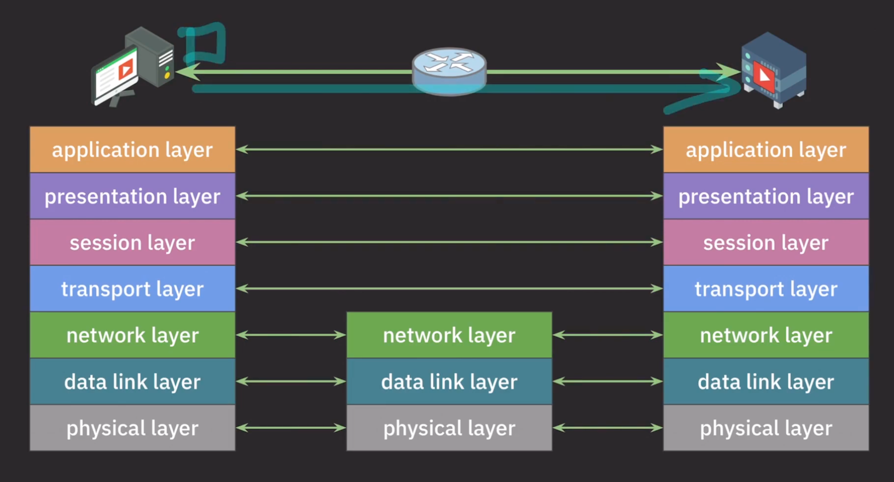
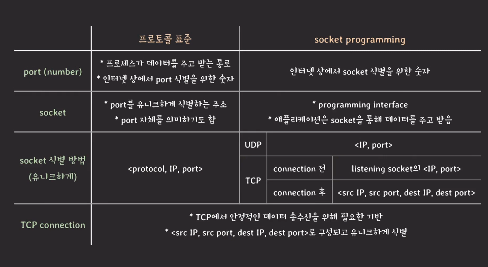

# 프로토콜
네트워크는 컴퓨터나 기타 기기들이 리소스를 공유하거나 데이터를 주고 받기 위해 유선, 무선으로 연결된 통신 체계

네트워크는 다양한 기능을 가지고 있다. 
- 어플리케이션 목적에 맞는 통신 방법 제공 : 애플리케이션 사이에서 필요한 기능
- 신뢰할 수 있는 데이터 전송 방법 제공 : 애플리케이션 사이에서 어떻게 안전하게 데이터를 전송할지?
- 네트워크간의 최적의 통신 경로 결정
- 목적지로 데이터 전송 : 애플리케이션 사이의 호스트들이 어떻게 목적지까지 데이터를 보낼 수 있을지?
- 노드 사이의 데이터 전송 : 여러 노드들을 거칠때 노드와 노드 사이에는 어떻게 전송할 것인가?

> 네트워크의 통신 기능들이 제대로 동작하기 위해서는 참여자들 사이에서 약속된 통신 방법이 있어야한다.

> 네트워크 프로토콜이란 네트워크 통신을 하기 위해서 통신에 참여하는 주체들이 따라야하는 형식, 절차, 규약이다.

네트워크의 모든 기능을 단 하나의 프로토콜로 구현할 수 있을까? -> 없다!!!
네트워크의 모든 기능을 하나의 프로토콜로 구현하는 것은 하나의 클래스 파일에서 구현하는 것과 같다. 따라서 기능별로 분리 시켜 모듈화하는 것이 필요했다.

네트워크들이 가지고 있는 기능의 특성이 계층별로 동작하므로 이에 맞춰 프로토콜을 만들자

# OSI 7 Layer
범용적인 네트워크 구조를 모델링함
ISO/IEC 에서 모델 관리

| 계층 (Layer)           | 역할 및 설명                                      | 주요 프로토콜                        |
|------------------------|--------------------------------------------------|-------------------------------------|
| **7. 응용 계층 (Application Layer)**  | 사용자와 응용 프로그램 간의 인터페이스 제공. 데이터 포맷, 표현 및 암호화 등을 처리. | HTTP, FTP, SMTP, IMAP, POP3           |
| **6. 표현 계층 (Presentation Layer)**  | 데이터의 표현 형식 변환. 데이터 압축, 암호화 및 복호화, 데이터 형식 변환을 수행. | JPEG, GIF, SSL/TLS                    |
| **5. 세션 계층 (Session Layer)**       | 세션의 설정, 유지 및 종료를 관리. 데이터 전송의 동기화 및 복구. | NetBIOS, PPTP                         |
| **4. 전송 계층 (Transport Layer)**      | 데이터의 신뢰성 있는 전송 보장. 흐름 제어, 오류 검출 및 복구. | TCP, UDP                              |
| **3. 네트워크 계층 (Network Layer)**    | 데이터 패킷의 라우팅 및 전달. 네트워크 주소 지정 및 패킷 전송 경로 결정. | IP, ICMP, IGMP                        |
| **2. 데이터 링크 계층 (Data Link Layer)** | 물리적 주소 지정 및 오류 검출, 흐름 제어를 통해 안정적인 데이터 전송 보장. | Ethernet, PPP, HDLC                   |
| **1. 물리 계층 (Physical Layer)**       | 실제 전송 매체를 통한 비트의 전송. 전기적, 기계적, 절차적 특성 정의. | Ethernet, USB, RS-232                 |

각 레이어의 프로토콜은 하위 레이어의 프로토콜이 제공하는 기능을 사용하여 동작한다.
즉, 바로 아래의 레이어에서 구현된 프로토콜을 사용해서 자신의 기능을 구현한다.

### Application Layer
- 애플리케이션 목적에 맞는 통신 방법을 제공한다.
- 사용자에게 웹 페이지를 보여주고 싶다면 HTTP, 파일은 FTP, 도메인을 IP 주소로 바꾸고 싶다면 DNS, email 은 SMTP...
- 애플리케이션 간의 통신 방법을 제공하는 레이어이기 때문에 둘 사이에 어떻게 데이터를 보내고 받을 것인가는 아래 레이어에서 구현하고 여기서는 사용만 한다.

### Presentation Layer
- 애플리케이션의 통신에서 메시지 포맷을 관리한다.
- 어떤 character set 으로 인코딩 했는지, 암호화를 해서 보냈다면 암호화된 데이터를 복호화해서 다시 읽을 수 있도록 압축해서 보냈다면 압축 풀기를 해야한다.

### Session Layer
애플리케이션간의 통신에서 세션을 관리한다.
RPC (remote procedure call) 이 세션에 관한 것

### Transport Layer
- 애플리케이션간의 통신을 담당한다. 실제 목적지 애플리케이션으로 데이터를 전송한다.
- 목적지로 데이터를 보낼때 어떤 방식으로 데이터를 보낼것인가에 관해 결정한다. TCP , UDP

### Network Layer
- 어떤 목적지로 찾아갈지 정하는 기능을 담당한다.
- 호스트 간의 통신 담당(IP) 목적지 호스트로 데이터를 전송하는 역할을 담당
- 목적지 호스트의 IP 주소를 활용해서 데이터를 전송한다.
- 네트워크 간의 최적의 경로를 결정한다.

### Data Link Layer
- 각각의 노드 사이에서 어떻게 데이터를 전송할지
- 직접 연결된 노드간(장치와 장치간)의 통신을 담당한다
- MAC 주소 기반 통신(ARP)
  - IP주소를 Mac주소로 변환해줘야할 일이 생기는데 그것을 ARP 라고 한다.
- 헤더와 트레일러를 만든다. 트레일러는 제대로 전송됐는지 확인 함

### Physical Layer
- 물리적인 매개체를 통해서 데이터를 bits 단위로 데이터를 전송하는 일을 수행한다.

## encapsulation & decapsulation
각각의 노드가 레이어를 포장하고 까는 과정을 말한다.

# TCP/IP stack (4layer)

인터넷 특화된 프로토콜
IETF 에서 인터넷 표준을 RFC 로 관리한다.
TCP/UDP 는 transport layer 에 있는것, IP는 internet layer 에 소속 되어있다.

| 계층                  | 설명                                                                                 | 주요 프로토콜/기술                             |
|-----------------------|--------------------------------------------------------------------------------------|--------------------------------------------|
| 애플리케이션 계층 (Application Layer) | 사용자 애플리케이션이 네트워크에 접근할 수 있게 해주는 계층. 애플리케이션 간 데이터 교환을 담당.                  | HTTP, FTP, SMTP, DNS, HTTPS                |
| 전송 계층 (Transport Layer)  | 데이터의 신뢰성 있는 전송을 제공하는 계층. 데이터 분할, 오류 검출, 흐름 제어 등을 수행하며, 송신자와 수신자 간의 통신을 관리. | TCP, UDP                                   |
| 인터넷 계층 (Internet Layer)  | 데이터를 네트워크 간에 라우팅하는 계층. IP 주소를 사용해 패킷을 목적지로 전송.                                          | IP (IPv4, IPv6), ICMP, ARP, IGMP           |
| 네트워크 인터페이스 계층 (Network Interface Layer) | 실제 물리적 네트워크를 통해 데이터를 전송하는 계층. 데이터 링크 및 물리적 연결을 다룸.                             | 이더넷, Wi-Fi, PPP, MAC                    |

- 아래 세개의 레이어는 하드웨어/펌웨어, OS 레벨에서 구현하고 관리한다. system 에 해당한다.
  - 어플리케이션이 사용할 수 있도록 네트워크 기능을 지원하기 위한 목적으로 존재한다.
  - 네트워크 통신을 할 수 있도록 시스템상에서 지원하는 역할을 해서 시스템 레벨에서 구현된다.
- 어플리케이션 레이어는 어플리케이션 레벨에서 구현/관리된다.
  - 아래(시스템레이어)에서 만들어진 네트워크 기능을 사용하는 목적
- 포트와 소켓은 어플리케이션 레이어와 트랜스 포트 레이어 사이에 있는 개념

# port
- 프로세스와 연결된 data path 혹은 data channel
- 여러종류의 프로세스가 존재하고 여러종류의 프로세스가 각각 포트를 만들어서 시스템과 연결되어서 통신을 할 수 있다.
- 어떻게 포트를 유니크하게 식별할 수 있냐면 포트 네임을 통해서 식별한다.
  - 포트에 이름을 지정하는 방법은 각 운영체제 마다 다르다.

- internet protocol : 데이터가 유실될 수 있고 도착을 보장하지 않는다. 신뢰할 수 없다.
- 정확하게 데이터를 받는 것이 중요한데 신뢰할 수 없기때문에 프로세스 간의 통신에는 데이터를 안정적으로 주고 받을 수 있는 프로토콜이 필요하다 -> TCP 가 발명

# TCP connection
프로세스 간의 통신에서 데이터를 안정적으로 주고받을 수 있는 프로토콜

## Connection
프로세스 간의 안정적이고 논리적인 통신 통로
- 두 프로세스가 connection(3-way hand shake) 을 열고 데이터를 주고 받고 다시 connection(4-way hand shake) 을 닫는다.
  - 이렇게 connection 을 여닫는 방식을 connection-oriented 라고한다.
- 프로세스 간에 데이터를 안정적으로 주고 받기 위해서 set up 이 필요한데 커넥션을 여는동안 실행된다.
- 포트를 찾아갈 수 있어야하는데 인터넷 상에서 어떻게 port 를 유니크하게 식별할까?
  - `port number`라는 것을 정의했다. 포트 이름은 시스템마다 조금씩 달라서 통일된 식별 방법이 필요했다.
  - 16비트로 이루어진 숫자 (0~65535)
  - `port number` 만으로도 유니크하게 식별할 수 없다. 따라서 추가적인 무언가가 필요한데 인터넷 어드레스(IP)로 각 호스트를 유니크하게 식별할 수 있다.
  - internet address + `port number` 로 유니크하게 찾아갈 수 있겠네! -> socket

# socket
> `internet address` + `port number` 를 합친 개념

인터넷 상에 존재하는 각 port 를 유니크하게 식별하기 위한 목적으로 나온 개념으로 인터넷 상에서 고유해야한다는 특징이 있다.

## connection & socket
- 각 connection 을 유니크하게 식별할 수 있어야한다.
- 인터넷상에 존재하는 모든 TCP connection 은 유니크하게 존재해야한다.
- 한쌍의 socket 으로 connection 을 유니크하게 식별한다. 
  - A 컴퓨터의 어드레스+포트 : 소켓 B 컴퓨터의 어드레스+포트 : 소켓 이렇게 이루어진 한쌍의 소켓은 코넥션을 유니크하게 식별한다.
- 한쌍의 소켓이 커넥션을 이루고 커넥션은 유니크하다.
  - `<src internet addr, src port, dest inernet addr, dest port>`
- 하나의 소켓은 동시에 여러 connection 들에서 사용될 수 있다.

# UDP (user datagram protocol)
connetionless : 연결 맺지 않고 바로 데이터를 주고 받는다.
unreliable : internet protocol 을 거의 그대로 사용한다.
UDP 에서 처음에는 소켓에 대한 개념이 없었으나 용어의 사용이 확장되며 UDP 에서도 사용되었다.
소켓이 UDP 까지 확장되면서 <protocol, ip address, port number> 로 유니크하게 식별할 수 있게 되었다.

# 프로토콜 표준과는 다르게 실제로는 소켓이 어떻게 식별되는가?
- 어플리케이션 레이어가 시스템 레이어로부터 네트워크 기능을 받아서 통신을 사용하는데, 어플리케이션이 시스템의 기능을 함부로 사용할 수 없다. 
- 어플리케이션이 네트워크 기능을 사용하고 싶다면 시스템이 어플리케이션쪽에 프로그래밍 인터페이스를 제공해야한다. 그것을 바로 소켓이라고 한다. 
- 애플리케이션은 소켓을 통해 데이터를 주고 받는다. 
- 개발자는 소켓 프로그래밍을 통해 네트워크 상의 다른 프로세스와 데이터를 주고 받을 수 있도록 구현한다.

따라서 실제 프로그래밍의 관점에서 보면 네트워크를 통해 데이터를 주고받을 수 있는 인터페이스다.

대부분의 시스템은(운영체제) 소켓의 형태로 네트워크 기능을 사용할 수 있도록 제공한다.
application layer 의 프로토콜은 라이브러리나 모듈 형태로 기능을 제공하는데 이 기능 내부를 따라가보면 소켓을 활용해서 프로토콜을 구현했음을 알 수 있다.
직접적으로 소켓을 만지지는 않지만 라이브러리를 통해서 간접적으로 사용하고 있었다.

## 실제 구현에서의 소켓

socket <protocol, IP, port number>  
-> 프로토콜 스펙을 시스템 레벨에서 구현하면서 조금 달라짐  
-> UPD 는 유니크하게 식별이 되지만 TCP 는 실제 구현에서 유니크하게 식별할 수 없다.  

TCP 는 먼저 커넥션을 여는데 서버는 요청이 들어올 수 있도록 항상 기다리는 소켓이 있어야한다. : listening socket  
커넥션을 맺자고 요청이 들어오면 3way handshaking 으로 연결이된다. 
서버쪽에서 새로운 소켓을 만드는데 클라이언트는 새롭게 만들어진 소켓과 연결이 된다. 
다른 새로운 클라이언트가 연결하고 싶으면 리스닝 소켓으로 연결을 만들고 새로운 소켓을 만든다 
커넥션이 만들어지면서 새롭게 만들어진 소켓은 모두 동일한 IP 주소와 포트 넘버를 가지게 된다. 서버쪽의 TCP socket 은 ip와 port number 가 동일하다. 
그러면 각각의 데이터가 어떤 소켓으로 가는지 어떻게 식별하지? 
커넥션 연결요청은 리스닝 소켓으로 가고 커넥션이 성립이 된 이후에는 어떤 소켓으로 데이터를 보내야할지 식별할 수 없기 때문에 보낸쪽의 IP 주소와 port 넘버도 같이 보내 소켓을 식별한다. 

1. 커넥션이 맺어진지 데이터를 확인한다.
2. 커넥션이 안맺어졌으면 리스닝소켓으로 안맺어졌으면 다른 소켓으로보내야한다.
3. 여러 소켓중에 어떤 소켓으로 가야하는지 확인할 수 없기때문에 보낸쪽의 IP, port 넘버를 확인해서 새로 만들어진 소켓으로 데이터를 보낸다.

## 클라이언트 쪽에서도 같은 IP, port 를 가지는 서로 다른 TCP 소켓이 발생할 수 있을까?
클라이언트 소켓은 OS 레벨에서 알아서 바인딩하는데, 소켓이 너무 많이 만들어져서 새번호가 없으면 기존에 사용하던 포트를 재사용할 수도 있다. 
재사용된 소켓으로 연결을 맺게 되면 TCP 스펙상 4개의 값이 유니크 하지 않아서 커넥션을 맺을 수 없어짐

## port number
- 0 ~ 1023 : well-konw ports , system ports : HTTP 80 HTTPS 443 DNS 53
- 1024 ~ 49151 : registered ports (IANA 에 등록된 번호) : mysqlDB 3306, tomcat 8080
- 49152 ~ 65535 : dynamic ports (등록 안된 번호, 임시 또는 자동 할당시 사용)
