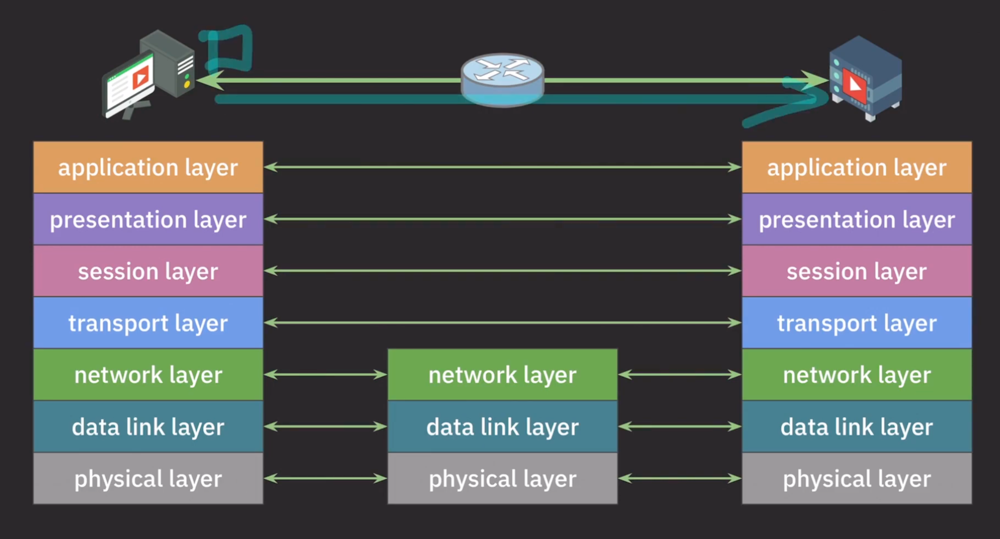
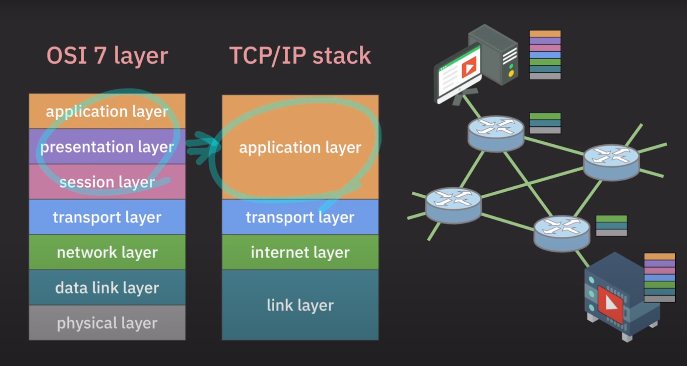

# 프로토콜
네트워크는 컴퓨터나 기타 기기들이 리소스를 공유하거나 데이터를 주고 받기 위해 유선, 무선으로 연결된 통신 체계

네트워크는 다양한 기능을 가지고 있다. 
- 어플리케이션 목적에 맞는 통신 방법 제공 : 애플리케이션 사이에서 필요한 기능
- 신뢰할 수 있는 데이터 전송 방법 제공 : 애플리케이션 사이에서 어떻게 안전하게 데이터를 전송할지?
- 네트워크간의 최적의 통신 경로 결정
- 목적지로 데이터 전송 : 애플리케이션 사이의 호스트들이 어떻게 목적지까지 데이터를 보낼 수 있을지?
- 노드 사이의 데이터 전송 : 여러 노드들을 거칠때 노드와 노드 사이에는 어떻게 전송할 것인가?

> 네트워크의 통신 기능들이 제대로 동작하기 위해서는 참여자들 사이에서 약속된 통신 방법이 있어야한다.

> 네트워크 프로토콜이란 네트워크 통신을 하기 위해서 통신에 참여하는 주체들이 따라야하는 형식, 절차, 규약이다.

네트워크의 모든 기능을 단 하나의 프로토콜로 구현할 수 있을까? -> 없다!!!
네트워크의 모든 기능을 하나의 프로토콜로 구현하는 것은 하나의 클래스 파일에서 구현하는 것과 같다. 따라서 기능별로 분리 시켜 모듈화하는 것이 필요했다.

네트워크들이 가지고 있는 기능의 특성이 계층별로 동작하므로 이에 맞춰 프로토콜을 만들자

# OSI 7 Layer
범용적인 네트워크 구조를 모델링함

| 계층 (Layer)           | 역할 및 설명                                      | 주요 프로토콜                        |
|------------------------|--------------------------------------------------|-------------------------------------|
| **7. 응용 계층 (Application Layer)**  | 사용자와 응용 프로그램 간의 인터페이스 제공. 데이터 포맷, 표현 및 암호화 등을 처리. | HTTP, FTP, SMTP, IMAP, POP3           |
| **6. 표현 계층 (Presentation Layer)**  | 데이터의 표현 형식 변환. 데이터 압축, 암호화 및 복호화, 데이터 형식 변환을 수행. | JPEG, GIF, SSL/TLS                    |
| **5. 세션 계층 (Session Layer)**       | 세션의 설정, 유지 및 종료를 관리. 데이터 전송의 동기화 및 복구. | NetBIOS, PPTP                         |
| **4. 전송 계층 (Transport Layer)**      | 데이터의 신뢰성 있는 전송 보장. 흐름 제어, 오류 검출 및 복구. | TCP, UDP                              |
| **3. 네트워크 계층 (Network Layer)**    | 데이터 패킷의 라우팅 및 전달. 네트워크 주소 지정 및 패킷 전송 경로 결정. | IP, ICMP, IGMP                        |
| **2. 데이터 링크 계층 (Data Link Layer)** | 물리적 주소 지정 및 오류 검출, 흐름 제어를 통해 안정적인 데이터 전송 보장. | Ethernet, PPP, HDLC                   |
| **1. 물리 계층 (Physical Layer)**       | 실제 전송 매체를 통한 비트의 전송. 전기적, 기계적, 절차적 특성 정의. | Ethernet, USB, RS-232                 |

각 레이어의 프로토콜은 하위 레이어의 프로토콜이 제공하는 기능을 사용하여 동작한다.
즉, 바로 아래의 레이어에서 구현된 프로토콜을 사용해서 자신의 기능을 구현한다.

### Application Layer
- 애플리케이션 목적에 맞는 통신 방법을 제공한다.
- 사용자에게 웹 페이지를 보여주고 싶다면 HTTP, 파일은 FTP, 도메인을 IP 주소로 바꾸고 싶다면 DNS, email 은 SMTP...
- 애플리케이션 간의 통신 방법을 제공하는 레이어이기 때문에 둘 사이에 어떻게 데이터를 보내고 받을 것인가는 아래 레이어에서 구현하고 여기서는 사용만 한다.

### Presentation Layer
- 애플리케이션의 통신에서 메시지 포맷을 관리한다.
- 어떤 character set 으로 인코딩 했는지, 암호화를 해서 보냈다면 암호화된 데이터를 복호화해서 다시 읽을 수 있도록 압축해서 보냈다면 압축 풀기를 해야한다.

### Session Layer
애플리케이션간의 통신에서 세션을 관리한다.
RPC (remote procedure call) 이 세션에 관한 것

### Transport Layer
- 애플리케이션간의 통신을 담당한다. 실제 목적지 애플리케이션으로 데이터를 전송한다.
- 목적지로 데이터를 보낼때 어떤 방식으로 데이터를 보낼것인가에 관해 결정한다. TCP , UDP

### Network Layer
- 어떤 목적지로 찾아갈지 정하는 기능을 담당한다.
- 호스트 간의 통신 담당(IP) 목적지 호스트로 데이터를 전송하는 역할을 담당
- 목적지 호스트의 IP 주소를 활용해서 데이터를 전송한다.
- 네트워크 간의 최적의 경로를 결정한다.

### Data Link Layer
- 각각의 노드 사이에서 어떻게 데이터를 전송할지
- 직접 연결된 노드간(장치와 장치간)의 통신을 담당한다
- MAC 주소 기반 통신(ARP)
  - IP주소를 Mac주소로 변환해줘야할 일이 생기는데 그것을 ARP 라고 한다.
- 헤더와 트레일러를 만든다. 트레일러는 제대로 전송됐는지 확인 함

### Physical Layer
- 물리적인 매개체를 통해서 데이터를 bits 단위로 데이터를 전송하는 일을 수행한다.

## encapsulation & decapsulation
각각의 노드가 레이어를 포장하고 까는 과정을 말한다.

# TCP/IP stack (4layer)

인터넷 특화된 프로토콜