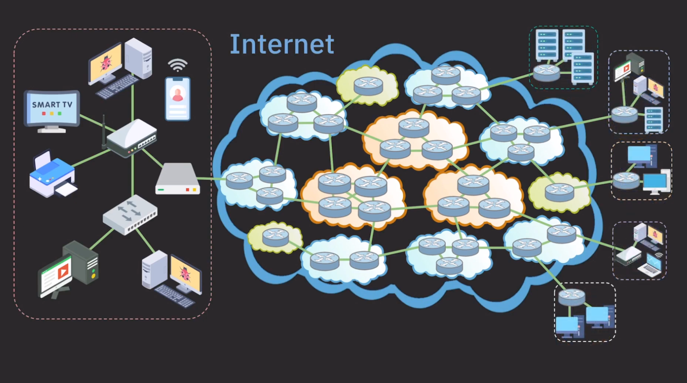

# network
> 두 대 이상의 컴퓨터를 케이블로 연결하여 네트워크를 구성하는 것을 네트워킹이라고 한다.

## 클라이언트 / 서버
클라이언트는 서비스를 사용하는 컴퓨터, 서버는 서비스를 제공하는 컴퓨터
서버가 제공하는 서비스의 종류에 따라 파일서버, 메일서버, 어플리케이션 서버 등이 있다. 
전용서버를 두는 것을 서버기반 모델이라하고 전용 서버 없이 각 클라이언트가 서버 역할을 동시에 수행하는 것을 P2P모델이라고 한다.

### 서버 기반 모델
- 안정적인 서비스의 제공이 가능하다.
- 공유 데이터의 관리와 보안이 용이하다.
- 서버 구축비용과 관리 비용이 든다.

### P2P모델
- 서버 구축 및 운용비용을 절감할 수 있다.
- 자원의 활용을 극대화 할 수 있다.
- 자원의 관리가 어렵다.
- 보안이 취약하다

## IP 주소
IP 주소는 4바이트의 정수로 구성되어 있으며 4개의 정수가 마침표를 구분자로 a.b.c.d 와 같은 형식으로 표현된다.
a,b,c,d 는 0~255 사이의 정수이다. IP 주소는 다시 네트워크 주소와 호스트 주소로 나눌 수 있는데, 32bit 의 IP 주소 중에서 
네트워크 주소와 호스트주소가 각각 몇 bit를 차지하는지는 네트워크를 어떻게 구성하였는지에 따라 달라진다.

IP주소와 서브넷 마스크를 비트연산자 & 로 연산하면 IP 주소에서 네트워크 주소만을 뽑아낼 수 있다.
IP 주소에서 네트워크 주소가 차지하는 자리수가 많을 수록 호스트 주소의 범위가 줄어들기 때문에 네트워크의 규모가 작아진다.
호스트 주소의 자리수가 8자리이면 2의 8승개의 (256) 호스트만 이 네트워크에 포함될 수 있다.
호스트 주소가 0인것은 네트워크 자신이고 255는 브로드 캐스트 주소로 사용되기 때문에 실제로는 네트워크에 포함 가능한 호스트 개수는 254개이다.

### 서브넷 마스크?
IP 주소를 네트워크/호스트로 나누는데 사용되는 32비트 숫자이다.
네트워크에서 IP 주소를 더 작은 네트워크로 나누기 위해 사용되거나 주로 IP 주소를 결정하는 역할을 한다.

## InetAddress
IP 주소를 다루기 위한 클래스다. 

## URL (Uniform Resource Locator)
> 프로토콜://호스트명:포트번호/경로명/파일명?쿼리스트링#참조

프로토콜 : 자원에 접근하기 위해 서버와 통신하는데 사용되는 통신 규약 (http)
호스트명 : 자원을 제공하는 서버의 이름 (www.naver.com)
포트번호 : 통신에 사용되는 서버의 포트번호(80)
경로명 : 접근하려는 자원이 저장된 서버상의 위치 (/sample/)
파일명 : 접근하려는 자원의 이름(hello.html)
쿼리 : URL 에서 ? 이후의 부분
참조 : # 이후의 부분

## URLConnection
어플리케이션과 URL 간의 통신 연결을 나타내는 클래스의 최상위 클래스로 추상클래스이다.
`HttpURLConnection`과 `JarURLConnection` 이 구현했다.
URL 의 프로토콜이 http 라면 `openConnection()`은 `HttpURLConnection` 를 반환한다.
URL에 연결하여 내용을 읽어오는데 만일 URL 이 유효하지 않으면 Malformed - URLException 이 발생한다.
`url.openStream()` 은  `openConnection()` 을 호출해서 `URLConnection` 을 얻은 다음 다시 `getInputStream()`을 호출한 것과 같다.
즉, URL 에 연결해서 `InputStream`을 얻어온다.

# 쉬운코딩 : 네트워크
> 네트워크 : 컴퓨터나 기타 기기들이 리소스를 공유하거나 데이터를 주고받기 위해 유선, 무선으로 연결된 통신체계

1. IP 주소는 인터넷에 연결되기 위한 인터넷 상의 주소
2. 물리적으로 인터넷과 연결되기 위해서는 케이블선과 모뎀을 연결한다.
3. 모뎀을 공유기에 연결한다 공유기는 공유기에 연결된 기기들이 인터넷이 연결될 수 있도록 하는 장치, 하나의 IP 주소로 공유기에 연결된 기기들이 동시에 인터넷에 접속할 수 있게 한다. 연결된 기기들은 모두 같은 네트워크 소속이된다.
4. 랜선을 통해서 또는 와이파이를 통해서 공유기에 연결이 된다.
5. 각각의 기기들이 공유기를 통해서 인터넷과 연결이 된다. 각각의 기기들도 서로 네트워크 통신이 가능하다.
6. 공유기의 랜포트가 부족하면 스위치를 공유기와 연결한다. 스위치는 같은 네트워크내의 기기들이 서로 통신할 수 있도록 하는 장치이다. 랜포트 수를 늘려주고 싶을때 사용한다. 허브라고도 불린다.

## LAN local area network
집, 학교 회사 건물 처럼 제한된 범위 내에서 컴퓨터나 기타 기기들을 연결해서 데이터나 리소스를 공유할 수 있게 하는 네트워크를 LAN이라고 한다.
- Ethernet : 유선통신
- wireless LAN : 무선 통신 -> wifi

## WAN wide area network
서로다른 두개의 네트워크를 하나의 네트워크로 연결 시켜주는 것, 여러 LAN이나 다른 종류의 네트워크들을 하나로 묶어서 멀리 떨어진 기기들도 통신이 가능하도록 만든 네트워크
훨씬 더 넓은 범위를 커버하는 네트워크
예시로 은행의 ATM, wireles WAN, Internet

## internet
- the network of network
- the world's largest WAN
- global network
ISP : 일반 사용자나 회사, 기관등이 인터넷을 사용할 수 있도록 인터넷 연결 서비스를 제공하는 존재 : KT, SK, LG

## ISP를 통해서 어떻게 인터넷에 연결 될 수 있는거지?
KT 에 가입한사람이 다른 ISP 가입자와 어떻게 인터넷을 통해서 통신이 가능하지?
인터넷은 다양한 ISP 들이 자신의 네트워크를 가지고 있고 그 네트워크들이 서로 연결되어 통신을 할 수 있도록 구성되어있다.
내가 가입한 ISP 에 데이터를 보내면 ISP 가 다른 ISP 에 보내고 하는 식으로 연결이 된다.

## ISP 의 계급
역할과 규모에 따라 티어가 나뉜다.
- tier 1 backbone : 인터넷 중추 역할, 국제 범위의 네트워크 보유,
  - 인터넷의 모든 네트워크에 접근이 가능하다. tier1 -> tier3 로의 접근이 가능하다.
  - 개인이나 기업에 제공하는 경우는 드물고 인터넷에 연결된 모든 네트워크들이 서로 연결될 수 있도록 하는 핵심역할을 한다.
  - 트래픽 전송 비용이 없다. 티어원끼리는 서로 비슷한 체급이라 서로 비용을 정산하지 말자고 협약을 함.
  - 하위티어가 티어1을 이용할때는 비용이 발생하지만 티어1끼리는 비용이 발생하지 않는다.
- tier 2 국가/지방 범위 네트워크 보유 : 일반 사용자나 기업대상 서비스, KT, SK, LG...
  - 인터넷 모든 영역에 연결되기 위해 tier1 ISP 에 비용을 내고 트래픽 전송 
- tier 3 작은 지역 범위 서비스를 제공 : 미국같은 곳에는 꽤 존재
  - 일반 사용자나 기업 대상 서비스
  - 상위 ISP 에게 비용을 내고 인터넷 트래픽을 구매해서 이를 통해 서비스

## ISP 네트워크 간에는 어떻게 연결될까?
라우터라는 장치를 통해 목적하는 네트워크에 데이터를 보낸다.
라우터에 도착한 데이터는 원하는 서버의 IP 주소를 찾아 목적지 IP 주소를 보고 다른 라우터들을 찾아 타고타고 간다.

## 네트워크를 이루는 여러가지 장치
네트워크에 연결된 모든 장치를 통틀어서 NODE 라고 부른다.

| 노드 유형      | 설명                                                                                   |
|----------------|----------------------------------------------------------------------------------------|
| 엔드 시스템 (End System) | 사용자들이 직접 사용하는 장치. 컴퓨터, 스마트폰, 태블릿 등이 포함되며, 네트워크의 최종 목적지나 출발지 역할을 한다. |
| 라우터 (Router)  | 네트워크 간 데이터를 전달하는 장치. 패킷을 목적지까지 가장 효율적인 경로로 보내는 역할을 한다.                          |
| 스위치 (Switch)  | 동일 네트워크 내에서 장치들 간의 데이터 전송을 담당. 네트워크 트래픽을 관리하고 장치 간 데이터를 전달하는 역할을 한다.     |
| 허브 (Hub)      | 네트워크에 연결된 모든 장치에게 데이터를 전달하는 장치. 모든 포트로 동일한 데이터를 전송하는 비효율적인 장치로, 현대 네트워크에서는 잘 사용되지 않음. |
| 액세스 포인트 (Access Point) | 무선 네트워크(Wi-Fi)를 제공하는 장치. 장치들이 무선으로 네트워크에 접속할 수 있도록 한다.                        |
| 모뎀 (Modem)     | 인터넷 서비스 제공자의 네트워크와 가정 또는 사무실 네트워크를 연결하는 장치. 아날로그 신호와 디지털 신호를 변환하는 역할을 한다. |
| 게이트웨이 (Gateway) | 서로 다른 네트워크 간에 데이터를 전달하는 장치. 네트워크 간의 호환성 문제를 해결하는 역할을 한다.                        |
| 방화벽 (Firewall) | 네트워크 보안을 위한 장치로, 네트워크에 들어오고 나가는 트래픽을 모니터링하고 필터링하는 역할을 한다.                       |
| 프록시 서버 (Proxy Server) | 클라이언트와 서버 간의 중계 역할을 하는 장치로, 보안 및 프라이버시 강화, 캐싱 등의 역할을 수행한다.                      |
| 브리지 (Bridge)  | 두 개의 네트워크 세그먼트를 연결하여 데이터 전송을 가능하게 하는 장치. 이더넷 네트워크에서 주로 사용된다.                  |

| 엔드 시스템 구성 요소 | 설명                                                                                 |
|-----------------------|--------------------------------------------------------------------------------------|
| 서버 (Server)         | 서비스를 제공하는 엔드 시스템. 데이터, 애플리케이션, 파일 등을 제공하며, 클라이언트의 요청에 응답한다. 예: 웹 서버, 데이터베이스 서버. |
| 클라이언트 (Client)   | 서비스를 요청하는 엔드 시스템. 서버에서 제공하는 데이터나 서비스를 요청하고, 서버의 응답을 받는다. 예: 웹 브라우저, 이메일 클라이언트. |

